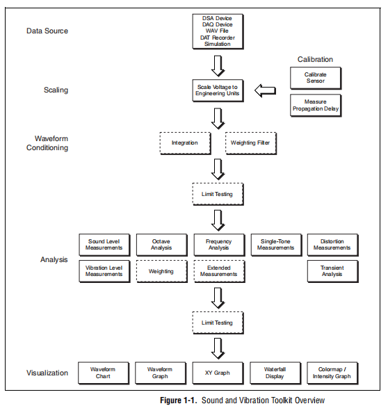
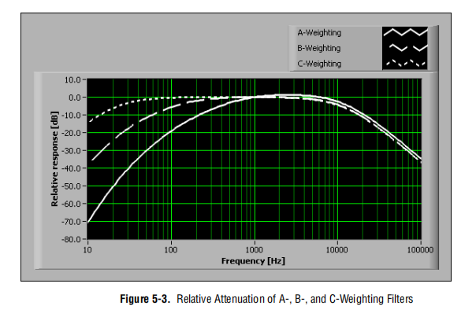
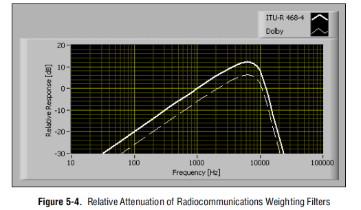
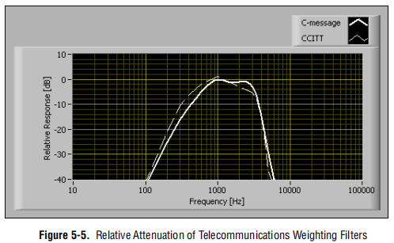

# LabVIEW声音和振动工具包简要总结

## 1. 引言

- 将信号缩放到工程单位（EU）
- 校准测量通道
- 应用加权滤波器
- 时域信号整合
- 执行级别测量
- 进行正弦扫频测量
- 进行单音测量
- 执行限制和屏蔽测试
- 执行分数倍频程分析
- 执行频率分析
- 进行瞬态分析
- 执行失真分析
- 显示结果

- **Scaling**

  SVL缩放电压至EU VI允许您将原始信号缩放至工程单位。至EU VI的SVL标度电压是声音和振动库的一部分。

- **Calibration**

  Calibration VIs允许您在选定的通道上执行端到端校准，并测量测量设备的传播延迟。校准变量是SVL的一部分。有关校准过程的信息，请参见第3章，比例和校准。有关单个校准vi的信息，请参阅LabVIEW帮助。

- **Limit Testing**

  SVT Limit Testing VI允许您将极限分析应用于所有类型的声音和振动工具包产生的测量结果。

- **Weighting**

  Weighting VIs允许您对时域信号应用A-、B-或C-加权滤波器。

- **Integration**

  SVT Integration VI允许您在时域信号上执行单集成或双集成。

- **Generation**

  SVT Pink Noise Waveform VI允许您生成连续的粉红噪声波形。

- **Vibration Level**

  Vibration Level VIs提供了通常用于振动测量的水平测量，包括测量波峰因子。平均模式包括均方根平均、指数平均和峰值保持性。

- **Sound Level**

  Sound Level VIs提供典型的声级测量，包括等效连续平均（Leq）、指数平均和峰值持有

- **Octave Analysis**

  倍频程分析VIs提供了一套工具来执行分数倍频程分析，包括1/1、1/3、1/6、1/12和1/24倍频频带分析。这个倍频程分析VIs可以适应任意的采样频率和分数倍频频带的大小。

- **Frequency Analysis**

  The Frequency Analysis VIs是基于离散傅里叶变换(DFT)和快速傅里叶变换(FFT)的频率分析工具的集合。频率分析还提供了细化FFT频率测量和扩展测量。

- **Transient Analysis**

  瞬态分析VIs提供了两种获取瞬态信号信息的技术。使用短时间傅里叶变换(STFT)提取频率信息作为时间或转速的函数。使用冲击响应谱(SRS)来评估冲击信号的严重程度。

- **Waterfall Display**

  瀑布显示VIs允许您将频率分析和倍频分析的结果显示为瀑布图。瀑布显示VIs生成并管理瀑布图的外部窗口。

- **Swept Sine**

  正弦扫描VIs允许您描述**被测试设备(DUT)**的频率响应。正弦扫描测量包括刺激水平、响应水平、频率响应（增益和相位）、**总谐波失真(THD)**和单个谐波失真的动态测量。

- **Distortion**

  失真VIs允许测量由于DUT中的非线性而引起的谐波、互调制和宽带噪声分量。

- **Single-Tone**

  单音VIs允许您执行单音测量，定义为激发是单个音调的一组测量值。这些测量通常用于测量线性响应，音频设备的非线性失真和噪声。

## 2. **Dynamic Signals（动态信号）**

### 获取和模拟动态信号

- 使用数据采集（DAQ）设备系统采集数据

- 从文件中读取数据

- 使用generation VI模拟数据

  

#### 混淆现象(**Aliasing**)

当一个动态信号被离散采样时，混叠是指大于奈奎斯特频率的频率分量被错误地移到较低频率的现象。

当使用NI**动态信号采集(DSA)**设备获取数据时，在任何采集中，混叠保护都是自动的。DSA设备上的锐利抗混叠滤波器跟踪样品速率，并滤波出（衰减）高于奈奎斯特频率的所有频率

#### 时间连续性(**Time Continuity**)

当您连续采集数据时，您可以使用波形数据类型中的t0参数，以确保通过连续调用DAQmx读VI或AI读VI返回的连续波形块之间没有间隙。当使用“生成”调色板”或“波形生成”调色板中的一个波形生成VI产生信号时，当前波形的t0比前一个波形中最后一个样本的时间戳晚一个采样周期。以这种方式强制执行连续性，直到重置生成为止。

## 3. **缩放和校准(Scaling and Calibration)**

### 缩放到工程单位(**Scaling to EU**)

### 执行系统校准(**Performing System Calibration**)

#### 传播延迟校准(**Propagation Delay Calibration**)

## 4. 极限测试分析(**Limit Testing Analysis**)

使用SVT极限测试VI对声音和振动工具包产生的任何类型的测量结果进行分析，包括以下测量结果:

- 波形 光谱 倍频程谱  功率谱峰 扫频

### 使用SVT极限测试VI

极限测试允许您对数据指定一个限制来定义一个传递范围。你可以输入一个标量到上限、下限，或者两者都指定一个恒定的上限和下限，以执行范围检测等测试。以执行范围检测等测试。您可以在SVT极限测试VI中输入上限掩码、下限掩码或两者都有，以根据测量中任何给定点的可接受结果定义形状和级别变化的通过范围。您还可以创建一个不连续的掩码，它允许您只对部分结果执行限制测试，而忽略其余结果。

## 5. 加权滤波器(**Weighting Filters**)

### 加权滤波器的用途

在许多涉及声学测量的应用中，最终的传感器是人耳。换句话说，声学测量通常试图描述人类耳朵对声音的主观感知。因为仪器设备通常用于提供线性响应，而耳朵是一个非线性传感器，特殊的滤波器，称为噪声计加权滤波器，被用来解释这些非线性。

### 噪声计加权滤波器(**Psophometric Weighting Filters**)

#### A-、B-和C-加权滤波器

- A-加权是一种高通滤波器，设计用于模拟对低音响度的感知。A-加权逐渐淡化了500 Hz以下的频率。
- B-加权模拟了对中等水平音调的响度的感知。B-加权很少使用
- c加权可去除20 Hz到20 kHz的音频范围之外的声音，并模拟对高音的响度的感知。

长波波段（低音）20 Hz～160 Hz（3个倍波段）

中波波段（中音）160 Hz～2500 Hz（4个倍波段）

短波波段（高音）2500 Hz～20000 Hz（3个倍波段）

这些滤波器的频率响应根据ANSI S1.4标准。下图显示了定义的相对衰减A-、B-和C-加权滤波器：

#### 无线电通信加权滤波器(**Radiocommunications Weighting Filters**)

**ITU-R 468-4和Dolby加权滤波器**是带通滤波器，用于强调对通常与音频电缆耦合的脉冲噪声类型的响应。通常，这些滤波器用于测量广播、录音系统和声音程序电路中的音频频率噪声。

下图为ITU-R 468-4和Dolby加权滤波器的相对衰减曲线。

#### 电信加权滤波器(**Telecommunications Weighting Filters**)

**CCITT和C-message加权滤波器**是用于测量电话电路上的音频噪声的带通滤波器。CCITT（ITU-T）滤波器用于国际电话电路。 C-message滤波器通常用于北美的电话电路。

### 应用加权滤波器(**Applying Weighting Filters**)

#### 对时域数据应用加权

使用“加权”选项板上的加权VIs将加权应用于时域信号。这些vi使用预先设计的滤波器来应用所需的psophometric 加权。预先设计的滤波器性质意味着它们只支持有限的样本率集。表5-1列出了具体的受支持的样本率。

| Sample Rates    | A, B, C-weighting | ITU-R 468-4/Dolby | CCITT/C-message |
| --------------- | :---------------: | :---------------: | :-------------: |
| 4 kHz to 20 kHz |        Yes        |                   |       Yes       |
| 20 kHz to 1 MHz |        Yes        |        Yes        |       Yes       |

## 6. **积分(Integration)**

### 积分振动数据时面临的挑战

将加速度数据转换为速度或位移数据提出了两个独特的挑战。

- 测量的信号通常包含一些不需要的直流部分。
- 许多传感器，特别是振动传感器，有较低的频率限制。传感器不能准确地测量传感器频率下限以下的频率分量。

#### **DC Component**

即使测量信号中的直流分量可能有效，但直流分量的存在表明DUT具有沿传感器轴的净加速度。对于一个典型的振动测量，DUT被安装或悬挂在测试装置中。DUT的净加速度为零。因此，测量加速度中的任何直流分量都是人为的，应该忽略。

**Transducers**（转换器）

大多数加速度和速度传感器的设计并不能精确测量接近直流的频率分量。与直流电的闭合度是相对的，并取决于特定的传感器。一个典型的加速度计可以准确地测量到大约10 Hz的组件。一个典型的速度探头可以准确地测量到2-3 Hz的分量。当信号被积分时，不准确测量的低频振动可能会主导响应，因为积分对低频分量的衰减低于高频分量。

#### 使用声音和振动工具包实现积分

SVT集成VI和SVT集成（频率）VI都解决了将加速度数据转换为速度或位移数据的挑战。

##### 时域积分

##### 频域积分

SVT积分VI的高通截止频率参数的常数为10 Hz。SVT积分（频率）VI没有高通截止频率参数。相反，如果频谱尺度是线性的，SVT积分（频率）VI将积分信号的直流分量设置为零，如果频谱尺度为分贝，则设置为负无穷大(-Inf)。

在以下情况下进行频域积分以最大限度地提高性能：

- 当时域不需要积分信号时
- 当进行频谱测量时

## 7. 振动水平测量

### 测量均方根（**Root Mean Square**,RMS）水平

振动测量的一个基本要求是测量加速度计返回的信号水平。加速度计信号的水平一般以均方根加速度(root-mean-square acceleration )表示。

将SVT RMS级别VI上的重启平均控制设置为TRUE。否则SVT RMS VI级累积中间结果以计算整个数据的RMS振动水平，而不是仅在最后一个数据块上进行水平测量。

### 计算波峰因子(**Crest Factor**)

波峰因子是给定信号的**峰值与均方根值的比值**，并表示波形的形状。波峰因子的定义如下式：

## 8. 声级测量

### 时间平均模式(**Time Averaging Modes**)

声级VIs提供以下时间平均模式：

- 线性(Linear)，这是等效的连续声级(Leq)
- 指数(Exponential)
- 峰值保持( Peak hold)

#### 线性平均(**Linear Averaging**)

通过将固定时间区间内的信号平方积分，再除以时间区间计算Leq。当您选择线性平均时，声级VIs将返回单个值。返回的值表示在与实际噪声历史相同的时间T内产生相同声能的连续分贝水平。要获得中间结果，必须将长时间记录分成几个较小的记录。线性平均用以下方程表示。

其中Po为声学参考压力，值为20µPa。

#### **指数平均(Exponential Averaging)**

指数平均是一个连续的平均过程，它对当前和过去的数据的权重不同。与当前数据相比，过去数据的权重取决于指数时间常数。在指数平均中，平均过程会无限期地继续下去。

#### 峰值保持(**Peak Hold**)

在峰值保持平均中，计算出所有先前值的最大测量声压级值并返回，直到一个新值超过当前的最大值。新值成为新的最大值，是新值超过之前返回的值。峰值保持实际上并不是一种真正的平均形式，因为连续的测量值并不是数学上的平均值。然而，与其他平均过程一样，峰值保持平均将几个测量的结果结合到一个最终的测量中。与指数平均一样，平均过程也会无限期地继续下去。峰值平均的公式由如下方程定义。

## 9. 分数倍频程分析

使用倍频程分析调色板上的倍频程分析VIs执行以下分析：

- 全倍频程
- 1/3倍频程
- 分数倍频程，包括1/1、1/3、1/6、1/12和1/24倍频程

倍频程分析VIs可以适应任何采样频率和任意大小的分数倍频程带。

### 分数倍频程分析综述

分数倍频程分析是对于音频分析和声音信号广泛使用的一种技术。分数倍频程分析，特别是1/3和1/12倍频程，表现出类似于人耳朵反应的特征。许多行业标准也需要分数八度分析，如ANSI和IEC。

分数倍频程测量的步骤：

1. 通过N个带通滤波器组发送一个时域信号。
2. 计算N个滤波器输出的瞬时平方值。
3. 根据选定的平均模式对瞬时平方进行平均值。
4. 在柱状图中显示平均值。

### 带宽和滤波器组

#### 倍频程滤波器(**The Octave Filter**)

倍频程定义为两个频率之间的间隔，其中一个是另一个频率的两倍。例如，250 Hz和500 Hz的频率间隔一个八度，1 kHz和2 kHz也是如此。图9-4显示了一个倍频程滤波器，一个通带覆盖一个八度的滤波器。

就像音叉为音乐家提供了一个440 Hz的参考频率一样，完全定义倍频程滤波器也需要一个参考频率来完全定义。仪器设备通常使用1 kHz的参考频率。

#### 边带频率(**Bandedge Frequencies**)

质量常数Q定义为带宽与滤波器中心频率的比值。对于倍频程滤波器的所有倍频带，Q保持不变。例如，中心频率为1000 Hz的倍频程滤波器会导致以下带边频率：
$$
f_1 = \frac{1000}{\sqrt2} = 707 Hz
$$

$$
f_2 = 1000\times\sqrt2 = 1414 Hz
$$

$$
BW = f_2-f_1 = 707 Hz
$$

$$
Q = \frac{707}{1000} = 0.707
$$

其中，f1和f2是边带频率，BW是带宽，Q是质量常数。

通过计算边带频率得到的结果表明以下带宽特性：

- 如果中心频率较低，倍频程滤波器的带宽较窄。
- 当中心频率较高时，倍频程滤波器的带宽更宽。

由于带宽特性，分数倍频程分析使用对数频率尺度来计算和显示倍频程光谱。

#### 分数倍频程滤波器

倍频程滤波器的分辨率是有限的，因为在16 Hz-16 KHz的范围内只有11个八度。为了克服倍频程过滤器分辨率的限制，可以使用分数倍频程过滤器。相较于使用单个滤波器覆盖一个倍频程，每个倍频程使用N个滤波器可以提高分辨率。在分数倍频程滤波器中，三倍频程（1/3）滤波器被广泛用于分数倍频程分析。
图9-5显示了频率为500 Hz、630 Hz时的1/3倍频程响应，
和800赫兹。

#### 滤波器沉降时间

当启动或重置分数倍频程滤波器的过滤操作时，需要一定的时间才能使测量有效。这个时间被称为沉降时间，与特定滤波器的带宽有关。最低的频带具有最小的带宽，并定义了分数倍频程测量有效之前所需的沉降时间。在声音和振动工具包中，沉降时间定义为5除以最低频带所使用的滤波器的带宽。一旦所有过滤器确定，过滤器确定的指示器就返回TURE。

## 10. 频率分析(**Frequency Analysis**)

### FFT 基础

#### 频率分辨率

用以下方程式计算频率分辨率：
$$
df = \frac{1}{T} = \frac{f_s}{N}
$$
其中，*df*是频域分辨率，*T*是采集时间，*fs*是采样率，N是采样点。

- 最大可分辨频率

  根据香农采样定理，最大可分辨频率必须是采样频率的一半。要计算最大可分辨频率，请使用以下公式：
  $$
  f_{max} = f_{Nyquist} = \frac{f_s}{2}
  $$

- 最小可分辨频率

  最小可分辨频率为0（直流）。术语基带分析通常被用来描述从0到*fs*的分析。

- 谱线数

  光谱中的线数是波形中样本数N的一半。

### 增加频率分辨率

增加频率分辨率有助于您区分两个单独的音调。例如，如果您分析一个包含1000 Hz和1100 Hz的两个音调的信号，请使用10000 Hz的采样频率采集10 ms的数据，此时频率分辨率为100 Hz。

以下策略可实现更高的频率分辨率：

- 降低采样频率fs。减少fs通常是不实际的，因为减少fs会减少频率范围。
- 增加样本数量N

通过细化FFT分析，实现减少fs策略。

使用基带FFT和FFT子集分析来实现增加的N策略。基带FFT分析和FFT子集分析均获得相同的频率分辨率。然而，FFT子集分析只计算频谱的一个狭窄的子集。

#### 选带傅里叶变换(**Zoom FFT**)分析

细化FFT分析比基带FFT获得了更精细的频率分辨率。Zoom FFT VI获取多个数据块和降采样(downsamples)以模拟较低的采样频率。块的大小与可实现的频率分辨率无关，因为Zoom FFT VI会积累被抽取的数据，直到获得所需的点数。因为变换是对一组抽取的数据进行操作，所以只需要计算一个相对较小的频谱。

Zoom FFT VIs按照以下步骤处理采样数据：

1. 调制采集的数据，使分析频带处于0频率。
2. 在时域内过滤调制数据，隔离分析波段，防止在较低采样频率下重新采样时混叠。
3. 抽取滤波后的数据，以降低有效采样频率。
4. 累计抽取的数据，直到有足够的样本来计算频谱。
5. 使用离散Zak变换(DZT)来有效地计算所需的光谱线。
6. 解调或移位计算出的频谱。

##### Zoom FFT VIs的频率分辨率

使用Zoom FFT VIs来计算窄频率范围内具有任意频率分辨率的的信号频谱：
$$
frequency\space resolution = \frac{stop\space frequency - start\space frequency}{number\space of\space lines}
$$
